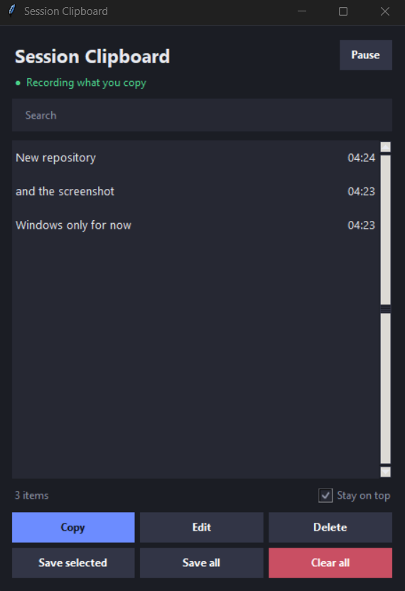

# Session Clipboard

A simple Windows app that remembers **everything you copy** while you work, not just the last thing.



## Why I built this

My daily work involves a lot of copying and pasting. The normal Windows clipboard only holds the last item you copied, so I was constantly going back to copy things again. On my Samsung phone, the clipboard shows everything I've recently copied, and I wanted exactly that on my laptop.

So I built Session Clipboard. Open it when you start working, and everything you copy is saved in a list. Close it when you're done, and your normal copy and paste goes back to how it was.

## Features

- **Saves everything you copy** while the app is open, newest at the top, with the time of each copy
- **Double-click any item** to copy it again, then paste with Ctrl+V
- **Select several items** and copy them together in one go
- **Edit** any saved item before pasting it
- **Search** to find something in a long list
- **Pause and Resume** whenever you don't want something saved
- **Save to notes**: send selected items (or everything) to a text file, `clipboard_notes.txt`, in your Documents folder
- **Dark, clean design** that stays on top while you work (can be switched off)
- **Closes cleanly**: when you close the app, it stops tracking. Nothing runs in the background.

## Download (Windows)

1. Go to the [**Releases**](../../releases) page.
2. Download **SessionClipboard.exe** from the latest release.
3. Double-click it to open. No installation and no Python needed.

> **"Windows protected your PC" warning?** This happens with free apps that aren't digitally signed. Click **More info**, then **Run anyway**. You can read all the code in this repository to see exactly what the app does.

## Run from source (optional)

If you'd rather run the code yourself:

1. Install [Python 3](https://www.python.org/downloads/) (tick **"Add python.exe to PATH"** during setup).
2. Download `clipboard.pyw` from this repository.
3. Double-click it, or open Command Prompt in the same folder and run:

```
python clipboard.pyw
```

It uses only the tools that come with Python, so there is nothing else to install.

## How to use it

1. Open the app when you start working.
2. Copy things as you normally would. Each one appears in the list.
3. Double-click an item (or select it and click **Copy**) to copy it again.
4. Use **Save selected** or **Save all** to keep items in your notes file.
5. Close the app when you're done.

## Good to know

- Text only for now. Copied images and files are not saved.
- The list lives in memory and is cleared when you close the app. Use **Save to notes** for anything you want to keep.
- Built and tested on Windows 11.
- Your clipboard stays on your computer. The app doesn't use the internet and doesn't send anything anywhere.

## Ideas for later

- A Mac version
- Image support
- Keyboard shortcuts

## License

Released under the [MIT License](LICENSE). Free for anyone to use, share and modify.

## Author

Made by **Rehoboth**. Feedback and ideas are welcome. Open an [Issue](../../issues) on this repository.
